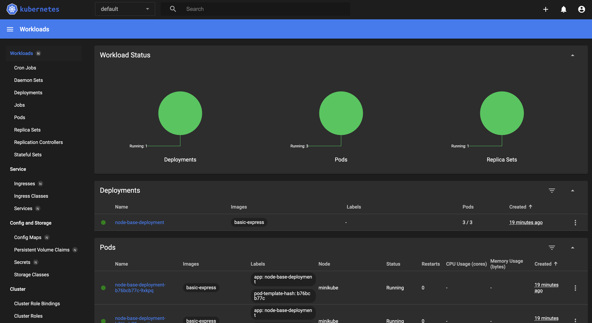

# Настраиваем Dashboard k8s

## Ставим `helm`

Добавить репозиторий 
```
helm repo add kubernetes-dashboard https://kubernetes.github.io/dashboard/
```
Разверните релиз Helm с именем «kubernetes-dashboard»
```
helm upgrade --install kubernetes-dashboard kubernetes-dashboard/kubernetes-dashboard --create-namespace --namespace kubernetes-dashboard
```
Получаем что-то такое 
```
*************************************************************************************************
*** PLEASE BE PATIENT: Kubernetes Dashboard may need a few minutes to get up and become ready ***
*************************************************************************************************

Congratulations! You have just installed Kubernetes Dashboard in your cluster.

To access Dashboard run:
  kubectl -n kubernetes-dashboard port-forward svc/kubernetes-dashboard-kong-proxy 8443:443

NOTE: In case port-forward command does not work, make sure that kong service name is correct.
      Check the services in Kubernetes Dashboard namespace using:
        kubectl -n kubernetes-dashboard get svc

Dashboard will be available at:
  https://localhost:8443
```
Вводим 

```
kubectl -n kubernetes-dashboard port-forward svc/kubernetes-dashboard-kong-proxy 8443:443
```

Идем сюда - https://localhost:8443

Смотри пространства

```
kubectl get namespace
```

Создаем аккаунт  (https://kubernetes.io/docs/reference/access-authn-authz/authentication/#service-account-tokens)
```
kubectl create serviceaccount demo
```

## Добавляем пользователя в пространство 
### Для конкретных действий 

**Если не уверены в своих силах, перейдите к следующему пункту**

```
kubectl create role deployment-reader --verb=get,list,watch --resource=deployments.apps --namespace=default
```

```
kubectl create rolebinding demo-deployment-binding --role=deployment-reader --serviceaccount=default:demo --namespace=default
```
Если надо протестить
```
kubectl get deployments --namespace=default
```
### Все права
https://kubernetes.io/docs/reference/access-authn-authz/rbac/
 
```
kubectl create clusterrolebinding default-admin --clusterrole cluster-admin --serviceaccount=default:demo
```

Генерим токен
```
kubectl create token demo
```

Вводим и видим такую красоту 



Если не видно - то вопрос к правам, придется настроить =) 