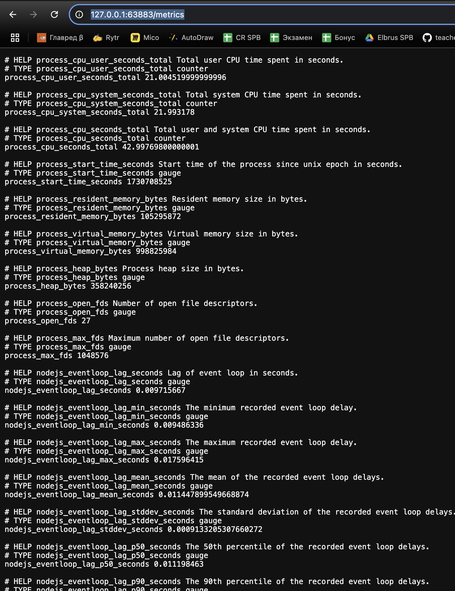
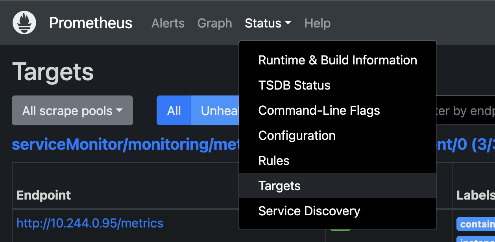
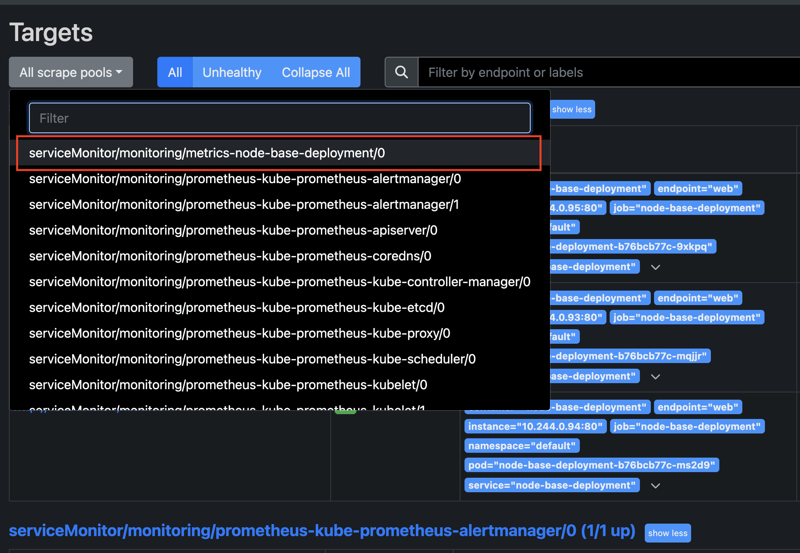
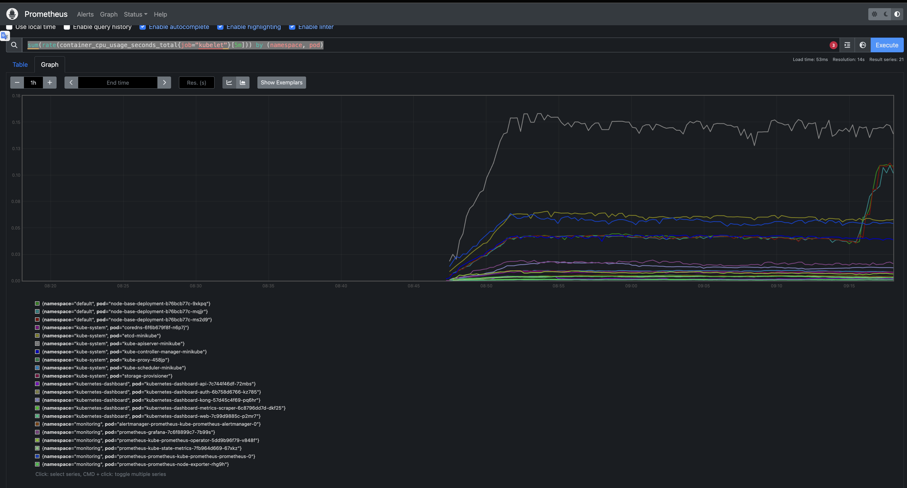
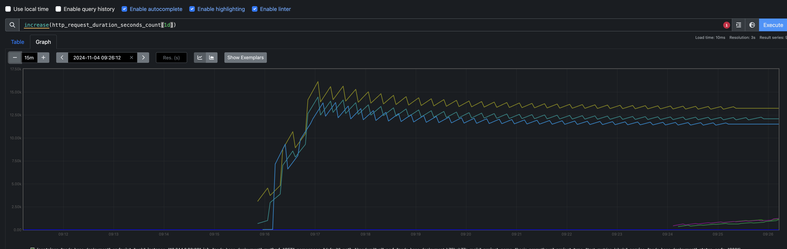

## Сбор метрик 

## Шаг 1: Ставим сборщик метрик в проект 

```bash
npm install prom-client express-prom-bundle --save
```

Настройка и подключение 

```js
//  параметры в промежуточное ПО Prometheus, большинство параметров предназначены для метрики гистограммы http_request_duration_seconds
const metricsMiddleware = promBundle({
  includeMethod: true,
  includePath: true,
  includeStatusCode: true,
  includeUp: true,
  customLabels: {
    project_name: "basic-prometheus",
    project_type: "test_metrics_labels",
  },
  promClient: {
    collectDefaultMetrics: {},
  },
});
app.use(metricsMiddleware);
```

Доступ к метрикам 

http://localhost:80/metrics 

## Шаг 2: Собираем Docker-образ проекта

[Информация тут](./docker.md)

## Шаг 3: Загружаем наш образ в `kubernetes`

```
minikube image load basic-express 
```
Где `basic-express`  - название локального образа docker


## Шаг 4: Запуск `deployment`

```
k apply -f deployment.yaml 
```

Файл стартует 3 пода и `deployment` node-base-deployment 

Посмотреть `deployments`:
```
k get deploy
```

Посмотреть `pods`:

```
k get pods
```

Удалить `deployment`

```
k delete deploy node-base-deployment
```

## Изменение количества подов 

```
k scale deploy node-base-deployment --replicas=5
```
Изменит количество `pods` до 5. 

## Запуск `service`

Как раз с сервиса и будем получать статистику

```
k apply -f service.yaml 
```

Посмотреть сервисы

```
k get service
```

Удалить сервис

```
k delete service node-base-deployment
```

## Проверяем работу 

Команда откроет наш сайт в браузере

```
minikube service node-base-deployment
```

Если перейти на страницу `/metrics` (http://127.0.0.1:63883/metrics) то там будет статистика по запросам.




## Dashboard

Что бы посмотреть все в визуальной оболочке, вам сюда, посмотреть [Dashboard](./dashboard.md)

## Добавляем Prometheus

Добавляем репозиторий
```
helm repo add prometheus-community https://prometheus-community.github.io/helm-charts
helm repo update
```
Создаем мониторинг
```
helm install prometheus prometheus-community/kube-prometheus-stack --namespace monitoring --create-namespace
```

Запускаем `service`

```
kubectl apply -f service-monitor.yaml 
```
 
Посмотреть 

```
kubectl get service --namespace=monitoring
```

Перенаправляем порты 

```
kubectl port-forward svc/prometheus-kube-prometheus-prometheus 9090:9090 -n monitoring
```

Идем на 9090 порт:  http://127.0.0.1:9090/

Далее в Targets и смотрим, что там есть наш сервис





Если его там нет, то опять вопрос к правам. Тут надо разбираться 😃

Для этого стартуем файлы 

```
kubectl apply -f clusterRole.yaml -f clusterRoleBinding.yaml 
```

## Эмуляция нагрузки  для сбора статистики

```
for i in {1..100}; do ab -n 500 -c 50 http://127.0.0.1:63883/random/10000 ; done
```

IP адрес берем тот, который дала команда для прокидывания портов нашего приложения

```
minikube service node-base-deployment
````

## Просмотр статики 

Идем в раздел Graph и вводим запрос 

```
sum(rate(container_cpu_usage_seconds_total{job="kubelet"}[5m])) by (namespace, pod)
```
Получаем статику по всем pods



К примеру, количество запросов 

```
increase(http_request_duration_seconds_count{}[10m])
```


